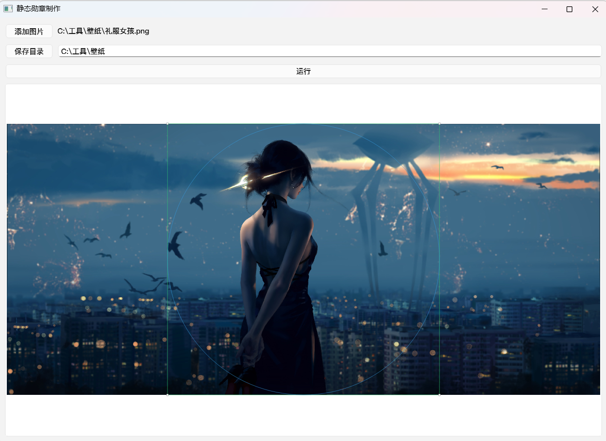

# 静态勋章制作

使用 PySide6 的图形界面工具：选择一张图片，拖动/缩放正方形裁剪框（内切圆会同步显示），一键导出圆形透明背景的 WebP。
能直接裁剪圆形的软件比较少，PS又比较大，所以写了这个软件。


## 功能

- 添加图片并显示
- 正方形裁剪框：可拖动/缩放，保持正方形且不超出原图
- 圆形裁剪框：内切正方形裁剪框（仅用于预览/导出遮罩）
- 选择保存目录（默认与原图同目录）
- 运行：按正方形裁剪并将圆形外区域置为透明，导出 WebP

## 运行

```bash
python -m venv .venv
source .venv/bin/activate   # win 运行  .venv\Scripts\activate
pip install -r requirements.txt
python main.py
```

导出文件默认命名为 `原文件名.webp`；若已存在，会自动追加 `_1`、`_2` 后缀避免覆盖。

## 打包（macOS x64）

```bash
chmod +x build_macos_x64.sh
./build_macos_x64.sh
```

图标：将 `1.icns` 放在项目根目录（脚本会自动打包为应用图标）。

产物：

- `dist_x64/静态勋章制作.app`
- `dist_x64/静态勋章制作-mac-x64.zip`（建议分发这个压缩包）

说明：未签名应用在其他电脑上首次打开可能会被 Gatekeeper 拦截，需要右键“打开”或在系统设置中允许。
